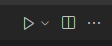

## O Python :snake:

O nome **Python** teve a sua origem no grupo humorístico britânico [Monty Python](https://pt.wikipedia.org/wiki/Monty_Python) (se tiver curiosidade, é possível encontrar alguns títulos no Netflix).

{: .figure }

A linguagem Python foi desenvolvida por [Guido van Rossum](https://en.wikipedia.org/wiki/Guido_van_Rossum) no início da década de 1990. Apesar de ser uma linguagem relativamente antiga, o seu uso apresentou [um crescimento significativo nos últimos anos](https://stackoverflow.blog/2017/09/06/incredible-growth-python/) e é hoje uma das linguagens de programação mais populares no mundo, sendo [amplamente utilizada por grandes empresas](https://www.python.org/about/quotes/) como Google, Netflix, Nasa, Dropbox, e muitos outros.

{: .figure width=70%}

Neste primeiro _handout_ vamos desenvolver nossos primeiros programas em Python, utilizando os seguintes conceitos básicos de programação: operações matemáticas, variáveis e funções.

!!! progress "Continuar"

## Instalação :inbox_tray:

Neste handout estamos assumindo que você já instalou o Python e o Visual Studio Code. Se você ainda não fez isso, consulte o [handout de configuração](../../../../sobre/configuracao/index.md) antes de prosseguir. Vamos também precisar do exercício "Olá mundo!" aberto.

[Acessar exercício "Olá mundo!"](../exercises/ola_mundo/index.md){ .ah-button }

!!! progress "Estou com exercício "Olá mundo!" aberto"

## Olá Mundo! :earth_americas:

Quando vamos aprender uma nova linguagem de programação é comum escrevermos um primeiro programa que, ao ser executado, mostra na tela o texto _Hello, world!_ ("Olá, mundo!"). Apesar de ser um programa muito simples, ele já nos permite começar a compreender dois aspectos da linguagem:

1. Qual é a "cara" da linguagem, ou seja, qual é a estrutura básica do código.
2. Como executar um programa escrito nessa linguagem.

{: .figure width=40% }

!!! exercise choice id_rodar_codigo_e_ver_resultado
    O código original desse exercício era:

    ```python
    print('Olá mundo!')
    ```

    1. Você deve ter modificado esse arquivo, então vamos retornar ao estado original apagando suas modificações e copiando este texto no arquivo `solution.py` aberto no exercício.
    2. Salve o arquivo clicando em "File --> Save" ou usando o atalho `ctrl+s` (Windows)/`cmd+s` (macOS).
    3. Execute seu programa. Para executar um programa em Python, temos quatro possibilidades:
        1. Clique em "Run --> Run Without Debugging"
        2. Utilize o atalho `ctrl+F5`
        3. Clique na setinha no canto superior direito:
            {: .figure width=20% }
    4. Veja o resultado da execução no `Terminal` (o painel que abriu na parte de baixo do VSCode)

    O que aconteceu ao executar o seu primeiro código?

    - [X] Foi impresso `Olá mundo!` no terminal.
    - [ ] Foi impresso `Hello, world!` no terminal.
    - [ ] Foi impresso `Hello, mundo!` no terminal.
    - [ ] Não imprimiu nada no terminal.

    !!! answer
        O texto `Olá mundo!` foi impresso no terminal.

        Parabéns! :tada:
        Você escreveu seu primeiro código em Python.

!!! progress "Continuar"

### Entendendo nosso primeiro programa

Nosso código possui apenas uma linha, mas já contém diversos conceitos importantes. Não se preocupe se não entender toda a explicação a seguir, tudo ficará mais claro conforme formos aprendendo mais. A linha `#!python print('Olá mundo!')` pode ser lida como: "Python, por favor, mostre na tela o texto `#!python Olá mundo!`. Vamos por partes.

Comecemos pela a função `#!python print`. Essa função é utilizada para mostrar texto no terminal. Podemos entender uma função como um comando do Python, ou seja, estamos dizendo para o computador **fazer** algo. A ação de mostrar algo na tela depende de uma informação adicional: o que deve ser mostrado. Essa informação da qual a ação depende é chamada de **argumento da função**. No nosso exemplo, o argumento da função `#!python print` é o texto `#!python 'Hello, world!'`.

!!! exercise choice id_print_argumento_funcao
    Considere o código a seguir:

    `#!python print('Python')`

    Qual é o argumento da função?

    - [ ] `#!python print`
    - [ ] `#!python print('Python')`
    - [X] `#!python 'Python'`

    !!! answer
        O argumento da função é `#!python 'Python'`, pois é a informação adicional que estamos passando para a função `#!python print`.

!!! progress "Continuar"

Um último detalhe importante é o uso das aspas. Para indicar que `#!python Hello, world!` é um texto, nós utilizamos aspas, que podem ser simples ou duplas. Isso é muito importante, pois o que estiver entre aspas será considerado pelo Python como texto (que chamamos de _string_) e não como um comando (por exemplo a função `#!python print`).

!!! exercise choice id*eh_ou_nao_string
    Qual das opções a seguir **NÃO** é considerado texto (\_string*) pelo Python?

    - [ ] `#!python "Hello, world!"`
    - [ ] `#!python 'Olá mundo!'`
    - [X] `#!python print`
    - [ ] `#!python "print"`

    !!! answer
        O trecho de código `#!python print` será considerado como um comando, pois não possui aspas simples ou duplas.

!!! progress "Continuar"

!!! info "Dica Pro: documente o código!"
    Uma lição a ser aprendida é que passamos **muito** mais tempo lendo código pré-existente do que escrevendo código novo. Por isso a documentação do código é uma prática extremamente importante. A documentação pode ser feita por meio de comentários, trechos de texto que não afetam o comportamento do programa, que ajudam o leitor (seja algum colega de trabalho que não conhece o código ou você mesmo algum tempo no futuro) a compreender o código.

    Veja a seguir um exemplo do mesmo programa que acabamos de executar, mas com documentação:

    ```python
    --8<-- "aulas/python/introducao/introducao-ao-python/hello.py"
    ```

    O texto entre `#!python """` será ignorado pelo programa. Note que nesse comentário podemos encontrar informações como:

    - O que o código faz;
    - Por que ele foi escrito;
    - Quem escreveu o código.

    Esse primeiro programa ainda é muito simples, mas conforme formos desenvolvendo programas mais complexos os comentários se tornam cada vez mais relevantes.

!!! progress "Continuar"

!!! exercise choice id_executa_ou_nao_comentario
    Considere o código a seguir:

    ```python
    """
    print("Comentários")
    """

    print("Testando comentários em Python!")
    ```

    O que será impresso no terminal?

    - [ ] *
    ```terminal
    Comentários
    Testando comentários em Python!
    ```
    - [X] *
    ```terminal
    Testando comentários em Python!
    ```
    - [ ] *
    ```terminal
    Comentários
    ```

    !!! answer
        Será impresso `Testando comentários em Python!`.
        Como o trecho de código `#!python print("Comentários")` está entre `#!python """`, o Python está ignorando esse trecho de código.

!!! progress "Continuar"

!!! info "Buscando ajuda"
    Depois de pensar e tentar resolver problemas por conta própria e não encontrar a solução, não tenha vergonha de procurar ajuda na internet. Até mesmo programadores experientes fazem isso. É importante, entretanto, saber como fazer essas buscas: que termos usar, quais respostas confiar, etc. Você vai desenvolver uma intuição conforme for ganhando experiência, mas para te ajudar neste começo, escrevemos um [pequeno guia com algumas dicas](../../../buscando-ajuda).

!!! progress "Continuar"

Agora vamos ver as operações matemáticas [operações matemáticas](../operacoes-matematicas/index.md).
